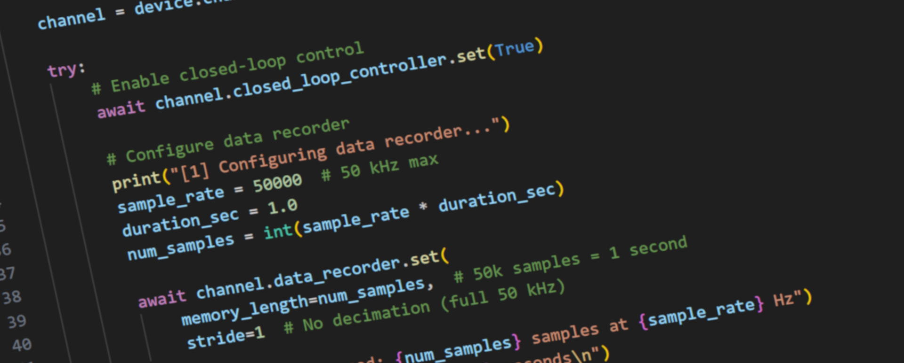

# PsjLib C# Library Documentation



**PsjLib** is a comprehensive C# library for controlling
piezoelectric amplifiers and control devices manufactured by
[piezosystem jena GmbH](https://www.piezosystem.com). The library
provides an intuitive, asynchronous interface for precision position
control, waveform generation, data acquisition, and advanced control
system configuration.

**Key Features:**

- **Asynchronous Architecture**: Built on .NET async/await for
  efficient, non-blocking device communication
- **Multi-Device Support**: Extensible framework supporting d-Drive,
  30DV50/300, and selected NV-series devices
- **Comprehensive Capabilities**: Full access to position control, PID
  tuning, waveform generation, data recording, and filtering
- **Multiple Transport Protocols**: Connect via Serial (USB) or Telnet
  (Ethernet)
- **Type-Safe API**: Complete type hints for excellent IDE autocomplete
  and type checking
- **Extensive Documentation**: Comprehensive docstrings, examples, and
  developer guides

**Currently Supported Devices:**

- **d-Drive**: Modular piezo amplifiers with 20-bit resolution, 50 kHz
  sampling, and advanced control features
- **30DV50/300**: Single-channel, standalone amplifier
- **NV40/3, NV40/3CLE**: NV-series amplifiers with open-loop and
  closed-loop variants

**Not currently supported:**

- **NV200D/NET**: Please use
  [nv200-python-lib](https://github.com/piezosystemjena/nv200-python-lib)
  for NV200D/NET devices

**Quick Start:**

``` csharp
using PsjLib.DDriveFamily;
using PsjLib.Transport;

var device = new DDriveDevice(TransportType.Serial, "COM3");
await device.ConnectAsync().ConfigureAwait(false);

try
{
  var channel = device.Channels[0];
  await channel.ClosedLoopController.SetAsync(true).ConfigureAwait(false);
  await channel.Setpoint.SetAsync(50.0).ConfigureAwait(false);
  var position = await channel.Position.GetAsync().ConfigureAwait(false);
  Console.WriteLine($"Position: {position:F2} µm");
}
finally
{
  await device.CloseAsync().ConfigureAwait(false);
}
```
